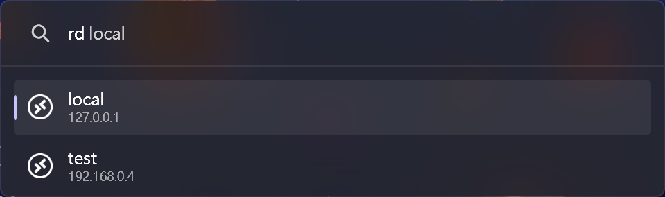

# Remote Desktop UWP Plugin for PowerToys Run

A [PowerToys Run](https://aka.ms/PowerToysOverview_PowerToysRun) plugin for opening connections in [Microsoft Remote Desktop](https://www.microsoft.com/store/productId/9WZDNCRFJ3PS) UWP app.

Checkout the [Template](https://github.com/8LWXpg/PowerToysRun-PluginTemplate) for a starting point to create your own plugin.

## Features

### Open Remote Desktop connection



## Installation

### Manual

1. Download the latest release of the from the releases page.
2. Extract the zip file's contents to `%LocalAppData%\Microsoft\PowerToys\PowerToys Run\Plugins`
3. Restart PowerToys.

### Via [ptr](https://github.com/8LWXpg/ptr)

```shell
ptr add RemoteDesktopUWP 8LWXpg/PowerToysRun-RemoteDesktopUWP
```

## Usage

1. Open PowerToys Run (default shortcut is <kbd>Alt+Space</kbd>).
2. Type `rd`.

## Building

1. Clone the repository and the dependencies in `/lib` with `RemoteDesktopUWP/copyLib.ps1`.
2. run `dotnet build -c Release`.

## Debugging

1. Clone the repository and the dependencies in `/lib` with `RemoteDesktopUWP/copyLib.ps1`.
2. Build the project in `Debug` configuration.
3. Make sure you have [gsudo](https://github.com/gerardog/gsudo) installed in the path.
4. Run `debug.ps1` (change `$ptPath` if you have PowerToys installed in a different location).
5. Attach to the `PowerToys.PowerLauncher` process in Visual Studio.

## Contributing

### Localization

If you want to help localize this plugin, please check the [localization guide](./Localizing.md)
